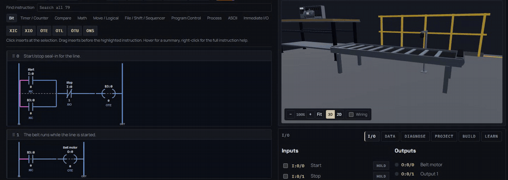
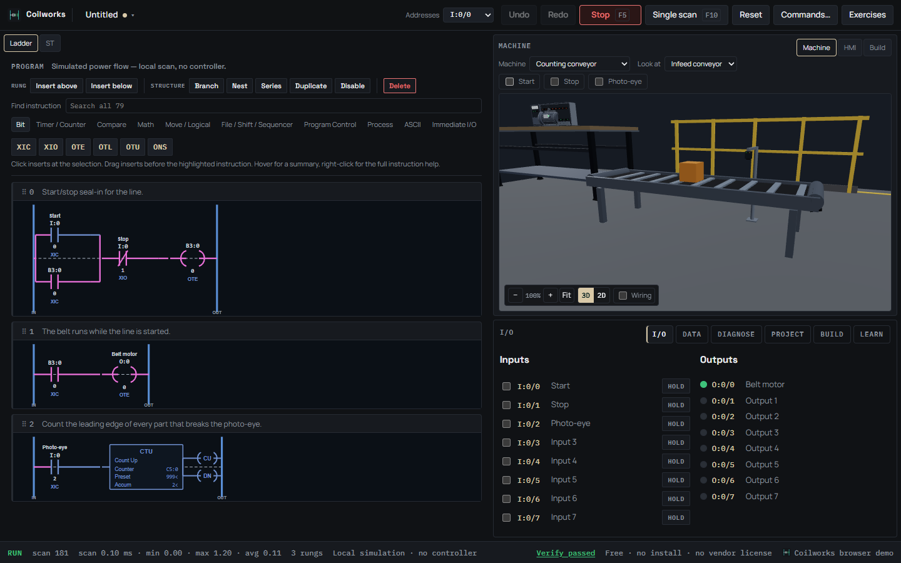

# Coilworks

Coilworks is a free PLC trainer. Write ladder logic, run it on a real scan engine, and watch a 3D
machine react to it. Sensors on the machine wire back into your inputs, so if you forget a seal-in
the box really does get stranded on the conveyor where you can see it.

It runs offline and it's vendor neutral. No license key, no subscription, nothing locked behind a demo.

**[Download the latest release](https://github.com/Phaenex/coilworks-releases/releases/latest)**
· **[Try it in your browser](https://coilworks-gray.vercel.app)** (nothing to install)

## Which file do I want?

| File | Use it when |
| --- | --- |
| `Coilworks-<version>-x64.exe` | Most Windows PCs. Installs for your user account, no admin rights needed. |
| `Coilworks-<version>-arm64.exe` | Windows on ARM (Surface Pro X, Snapdragon laptops). |
| `Coilworks-<version>-x64-portable.exe` | You can't install software, like a locked-down lab PC. Runs straight from the file. |

Windows 10 or 11. `SHA256SUMS.txt` on each release lists the checksum for every file.

The browser version has everything except talking to real hardware over Modbus and saving tutor keys.

## "Windows protected your PC"

Coilworks isn't code signed yet, so the first time you run it Windows may show that warning. Click
**More info**, then **Run anyway**. The file is exactly what's published on the release page, and you
can check it against `SHA256SUMS.txt` if you want to be sure.

## What's in it

- A ladder editor with 79 instructions, each with a worked example you can load and run
- Machines to watch and build: a tank, conveyors, a robot cell and more, in 3D or 2D
- Debug tools: single scan, breakpoints, a watch list, a per-rung profiler and a fault log
- A guided course whose lessons check your live program before you move on
- PLCopen XML and `.L5X` import and export
- An optional tutor, off unless you turn it on (bring your own key or run a local model)

Each release lists what's new and any known issues in its notes.

## Help

Found a bug or something confusing? [Open an issue](https://github.com/Phaenex/coilworks-releases/issues)
and say what you clicked and what happened.

## Support

Coilworks is free and it's staying free. If it helped you learn, a tip helps me keep building:
[Ko-fi](https://ko-fi.com/phaenex) or [GitHub Sponsors](https://github.com/sponsors/Phaenex).
Tips never unlock anything.

## License

Freeware: free to use, including in classrooms and training, but not open source. See [LICENSE](LICENSE).
This repository holds release downloads only.
